# **Networking Environment with Terraform**

**Project Introduction**  
This project demonstrates the process of creating a network environment for a website hosted on Ec2. This project is meant to demonstrate my understanding of the IAC service; Terraform. So far I have dealt with static websites that technically require no CPU processing power. However when dealing with dynamic sites or applications, a server is usually required and that is what I would be using to host the website in this project.

**Project Diagram**  

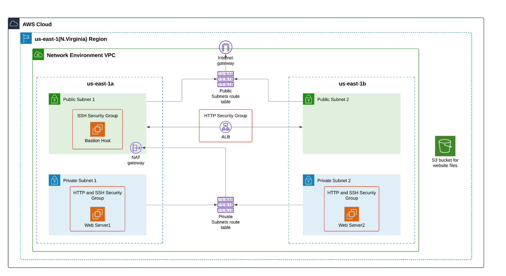  
The project diagram above illustrates that two EC2 instances will be created as the web servers to host the website, one in each availability zone: us east 1a and us east 1b. Both web servers will be located in private subnets with a route table directing traffic meant for the public internet(0.0.0.0/0) to a NAT gateway. Another EC2 instance created in the public subnet will serve as the Bastion Host for both web servers, ensuring another level of security. The public subnets will route traffic meant for the public internet to the internet Gateway attached to the VPC. An application load balancer spans across the two availability zones to serve incoming HTTP traffic to the web servers. An S3 bucket will host the web site files to be used by the web servers.

**What is EC2?**  
Amazon Elastic Cloud Compute in simple terms is the actual server resource provided by AWS to consumers. There are different configurations of CPU types, RAM, Storage and Network bandwidths packaged into a “Virtual Server” which is charged on a pay-as-you-go model. EC2 is the most barebones processing resource provided by AWS, hence you can control everything about your virtual server such as the OS and Applications installed including databases, web servers etc

**What is PuTTY?**    
PuTTY is an open source application that supports remote connection to a computer/server usually over SSH traffic using port 22\. It simulates a terminal environment which allows you to interact with your remote server. It also supports key pair authentication using the Private key on the local side of the connection.

**Services Used**  

- Terraform  
- S3  
- EC2  
- Load Balancer  
- VPC(Subnets, NAT Gateway, Internet Gateway)  
- PuTTY

**The Project**   
The [website zip file](https://github.com/KimAdrian1/AWS-Terraform-Networking-Environment/blob/94294dee010f3841473bd029db187abd6a0611ee/Movie-Website.zip) I used in this project is provided in this repository along with the [terraform](https://github.com/KimAdrian1/AWS-Terraform-Networking-Environment/blob/94294dee010f3841473bd029db187abd6a0611ee/Networking.tf) file. Before we get started, there are some prerequisites:

- Download and install PuTTY  
- First we need to create an RSA cryptographic key pair which would be used later on for remote SSH connection to the Bastion host and web servers  
- You can run the command: ssh-keygen \-t rsa \-b 4096 \-f “file path” to generate and save a private and public ssh key under the same file name. The private key is usually saved in a .txt format. We need to convert the private key to a .ppk format which is natively what PuTTY supports.

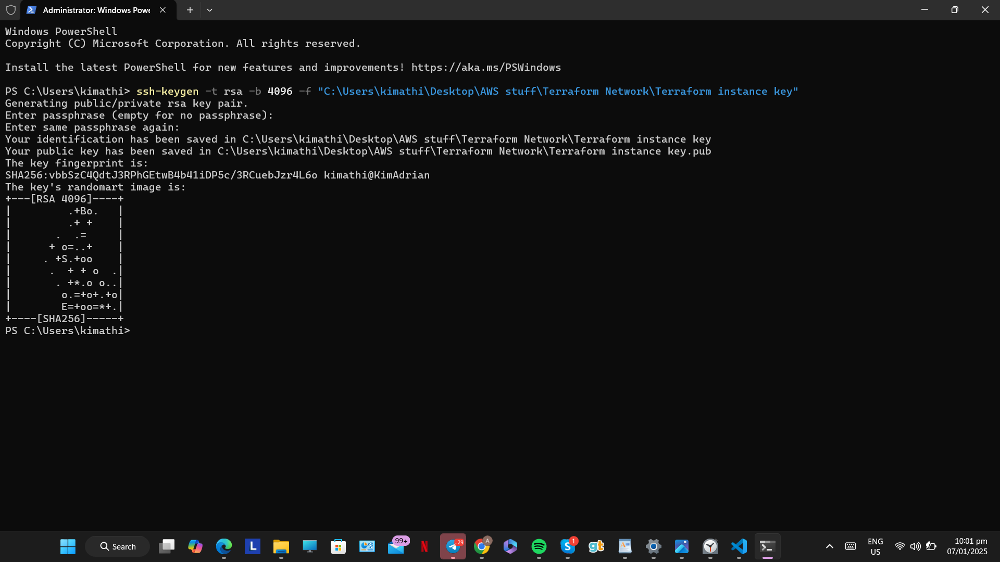

- In the directory where PuTTY was installed, you can find puttygen(and Pageant which will be used later on), which can also be used to generate keys or convert them from other formats to ppk.

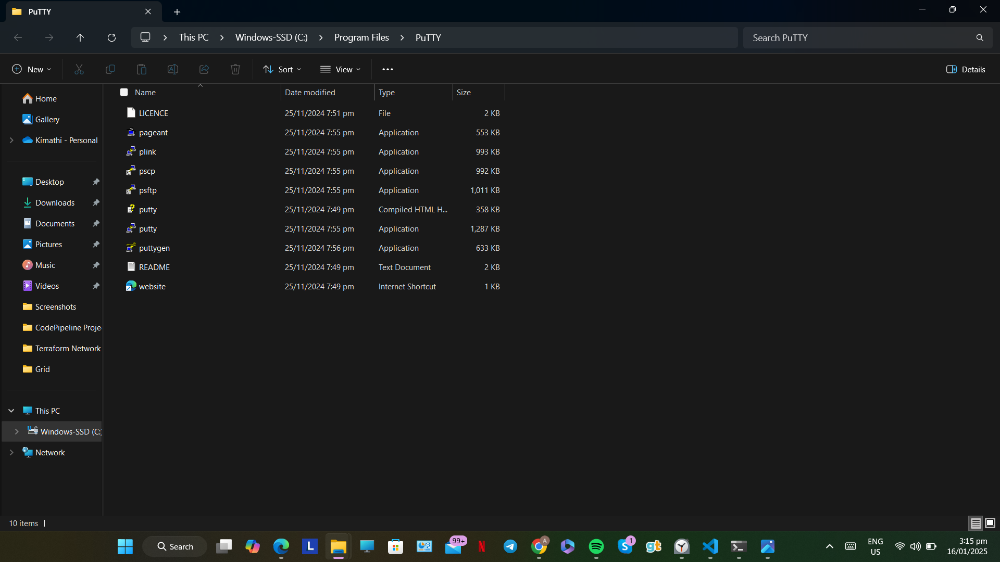

- In the puttygen app, load the private key from the path it was saved to and click on the save private key button to save the key as a .ppk file. We’ll use the public key later; it will be uploaded to AWS to be used by the EC2 instances.

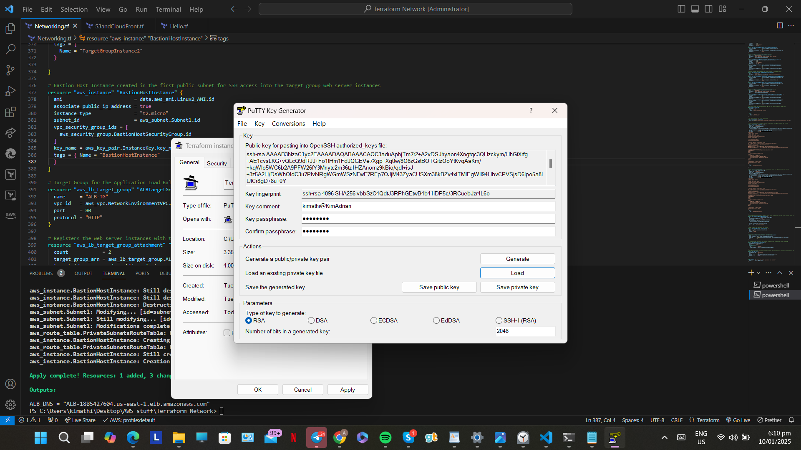

Now that the prerequisites have been taken care of, we can now head to the terraform file and create the AWS resources needed.

- In this screenshot, the first resource created is a VPC with a CIDR block of 10.0.0.0/16.  
- An internet Gateway, which allows communication between any resource in the VPC and the public internet, will be created and attached to the VPC.  
- An elastic Ip address and NAT Gateway will be created. The elastic IP will be allocated to the NAT Gateway.  
- A NAT Gateway is needed to route outbound traffic from the web server instances to the public internet. Since the web servers will be located in private subnets, the NAT Gateway will allow outbound traffic to flow. This is useful for installing or updating services on the server.

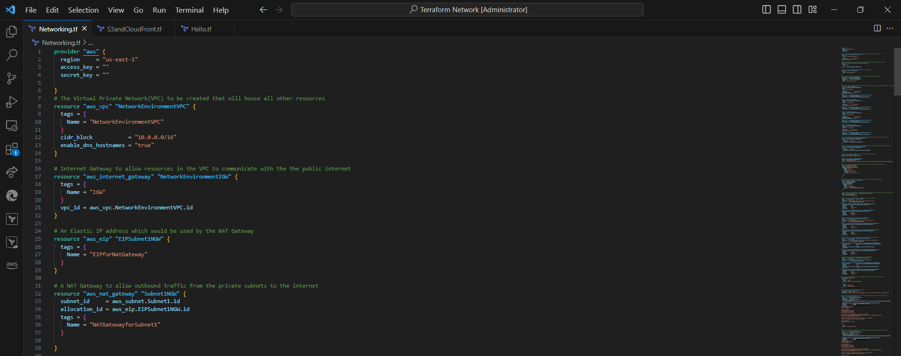

- 4 subnets will be created, 2 in us-east-1a and the other 2 in us-east-1b. Each availability zone will consist of one public subnet and one private subnet.  
- 2 availability zones are important because load balancers operate across at least 2 availability zones.  
- The public and private subnets will be associated with a public and private route table respectively.

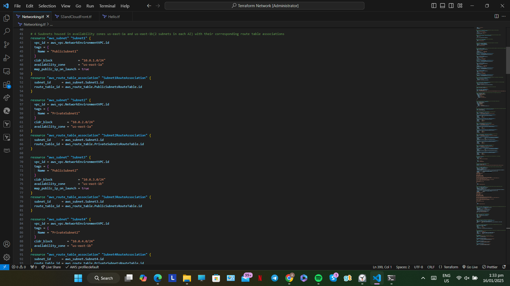

- The route table for the private subnets will route traffic destined for the public internet(0.0.0.0/0) to the NAT Gateway created earlier on.  
- On the other hand, the route table for the public subnets, will route traffic destined for the public internet(0.0.0.0/0) to the internet Gateway attached to the VPC.

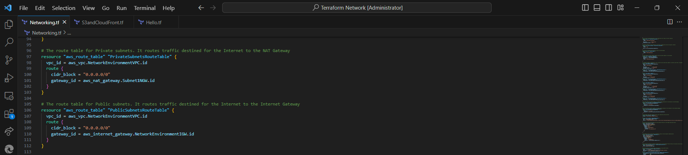

- An S3 bucket will be created to house the website files. The website files which are in a .zip file will be uploaded to the S3 bucket from my local pc.  
- Next are some prerequisites for the web servers. An IAM role needs to be created to allow the EC2 instances to access the S3 bucket created earlier. The attached policy for the role will allow EC2 to perform s3:GetObject actions on the S3 bucket.  
- The IAM instance profile resource specifies the role to be used by the web servers.

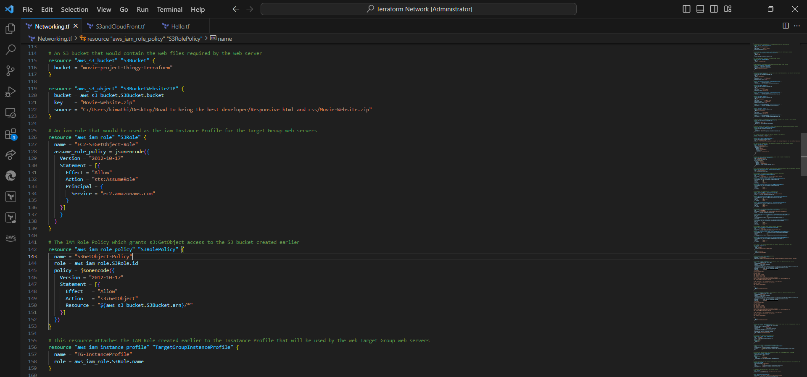

- A security group for the Application Load balancer will be created. The inbound security group rule will allow HTTP traffic from the public internet(0.0.0.0/0). The egress rule will allow all traffic from the load balancer to the public internet. The outbound rule must be explicitly declared since terraform removes the automatic outbound rule specified by AWS for security reasons.  
- A security group for the bastion host will be created to allow inbound SSH traffic from the public internet. The egress rule will allow all traffic from the bastion host out.

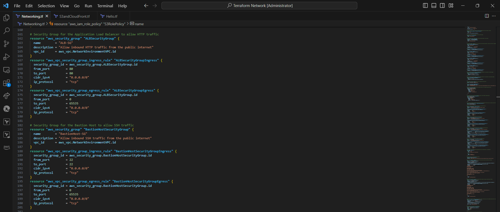

- Two security groups will be created for the web servers. The first to allow HTTP traffic from the load balancer and the second to allow SSH traffic from the bastion host.

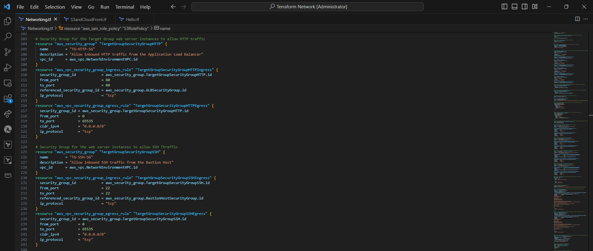

- A data source will be created to get the latest AMI id for Amazon Linux 2 using filters.  
- The public SSH key we created earlier using the ssh keygen command will be imported into AWS from the local file path.

- This section creates the two EC2 instances which will be the web servers hosting the website.   
- The first instance will be located in the us-east-1a private subnet. It will use the Amazon linux 2 AMI specified earlier and the public key specified earlier. The instance type is t2.micro since it is supported by the AWS free tier. The security groups for the instance are the HTTP and SSH security groups we created earlier. The IAM instance profile created gives it access to the S3 role.  
- The second instance will have the same configurations as the first however it will be located in the us-east-1b private subnet to facilitate load balancing and redundancy by the application load balancer.  
- The user data script will update the Amazon linux 2 system packages, install Apache, download and unzip the website zip file from the S3 bucket to the tmp directory then copy the contents of the unzipped website folder to the Apache web server directory “var/www/html”. After all this is done, apache will be restarted. The user script will be first executed after two minutes, to give time for the other network resources to be created.

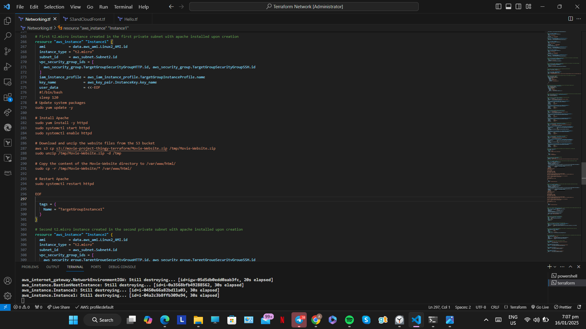

- The instance to be used as the bastion host will be created in the us-east-1a public subnet. The security group references the bastion host security group created earlier which would allow SSH traffic from the public internet. The purpose of the bastion host is to allow us SSH access to the web servers in the private subnets. This serves as an extra layer of protection without needing to use instance connect in the AWS console.

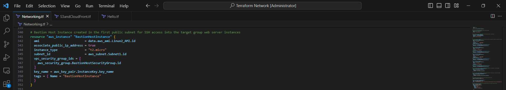

- This section defines the Application load balancer  
- First off, the Target group for the load balancer is created which contains the 2 web servers as the registered targets.  
- The listener for the load balancer listens for traffic on port 80(HTTP). It forwards any HTTP traffic received to the target group.  
- The load balancer distributes traffic received from the public internet between us-east-1a and us-east-1b. It is not an internal facing load balancer.

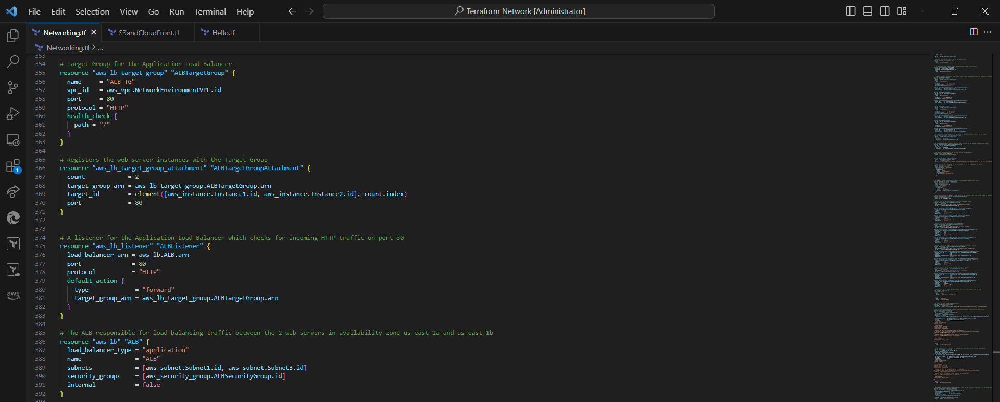

- Finally we have the outputs section of the code which would return the domain name of the application load balancer, the public ipv4 address of the bastion hosts and the private ipv4 addresses of the 2 web servers.

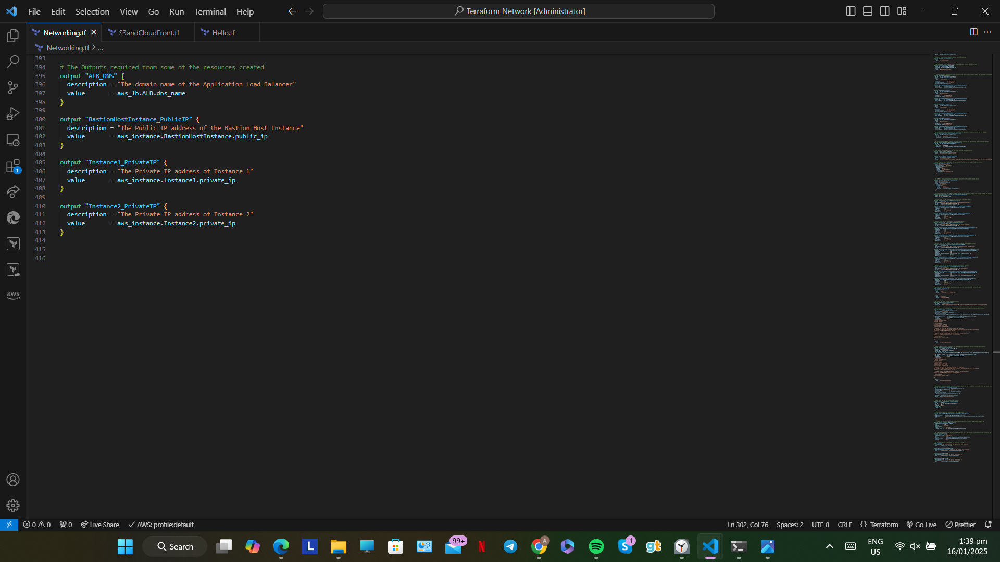

- To run the terraform file, its best practice to first run: “terraform validate” to ensure the syntax of your code is free from any errors.  
- Then run “terraform apply” to review the resources to be created and eventually run the code  
- After the resources are created, we get the output values back.  
- When we copy the load balancer DNS value to a browser, the web page should be displayed.

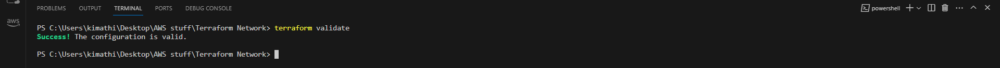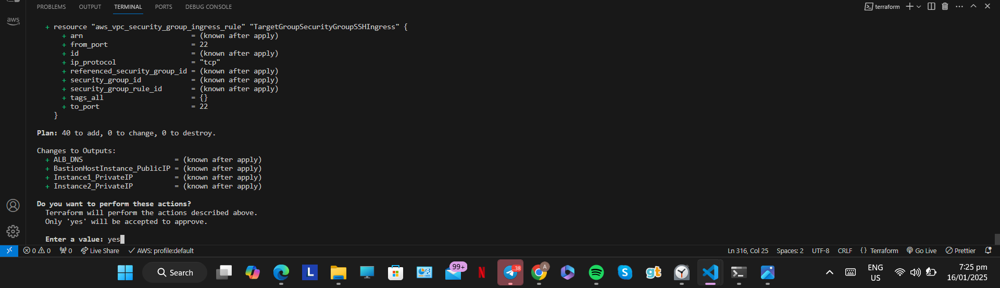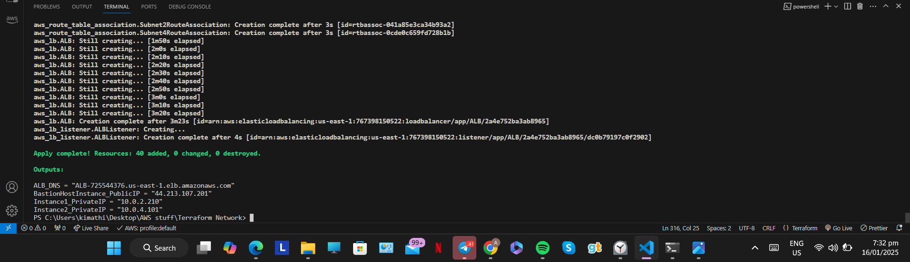

- The website is served from the web servers through the application load balancer.

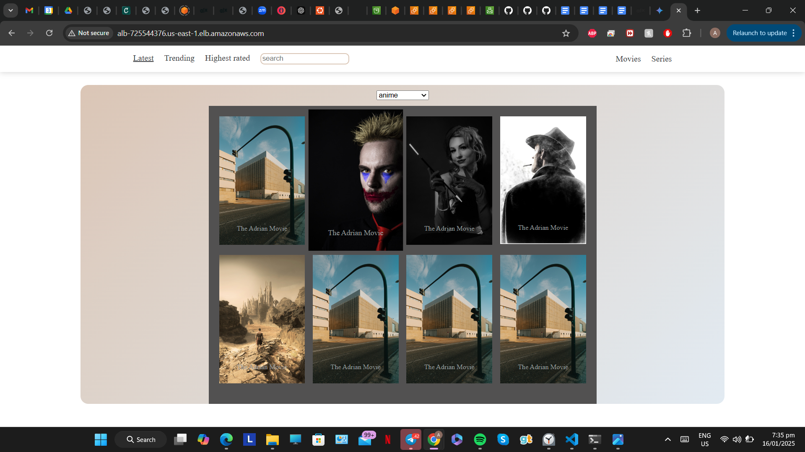

- We can view the Target group in the console. It shows that both targets are healthy. However, to test the function of the load balancer, which is to balance incoming traffic among multiple targets, we can simulate a crash or downtime on one of the web servers. The web site should still be up as all traffic will now be forwarded to the other web server.

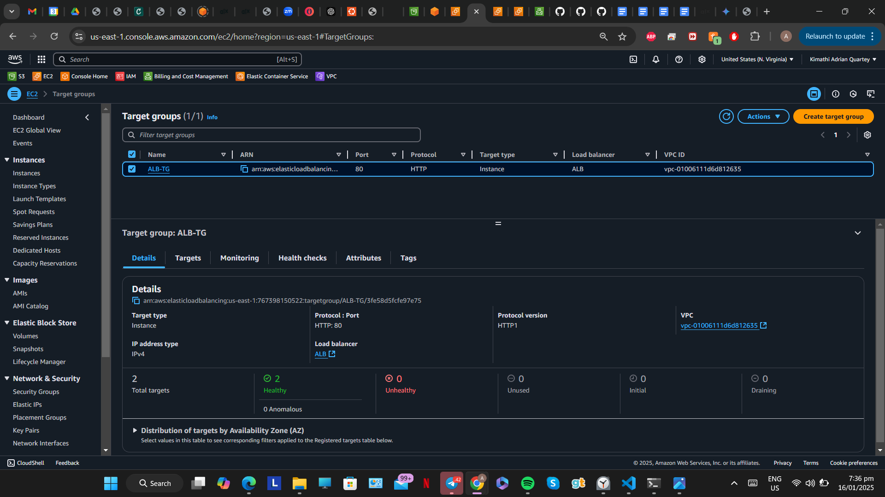

- We need to use PuTTy to connect to the Bastion host using the public IP we got in the terminal from the outputs.  
- Add the private key we converted into the .ppk earlier into Pageant.

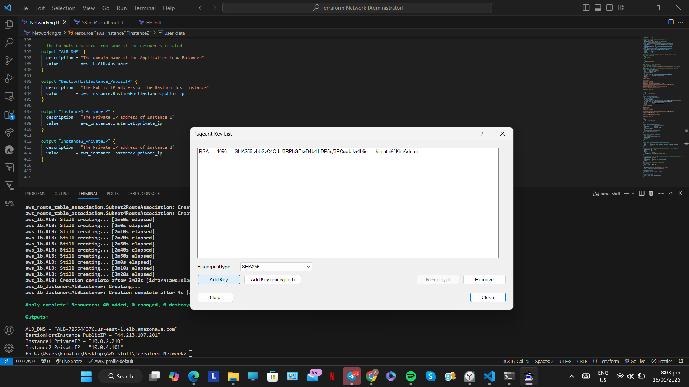

- Open up PuTTY and enter the public IP of the Bastion host as the Host. I also like to increase the time between keepalives under Connection to 120 seconds.

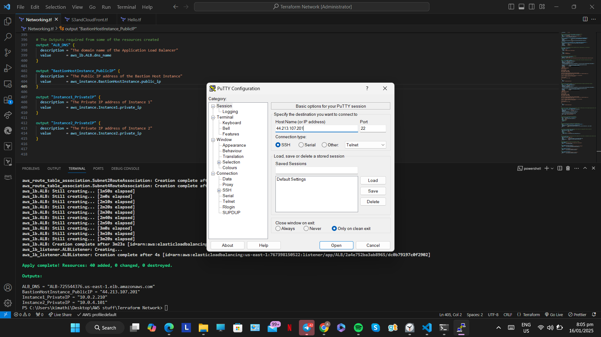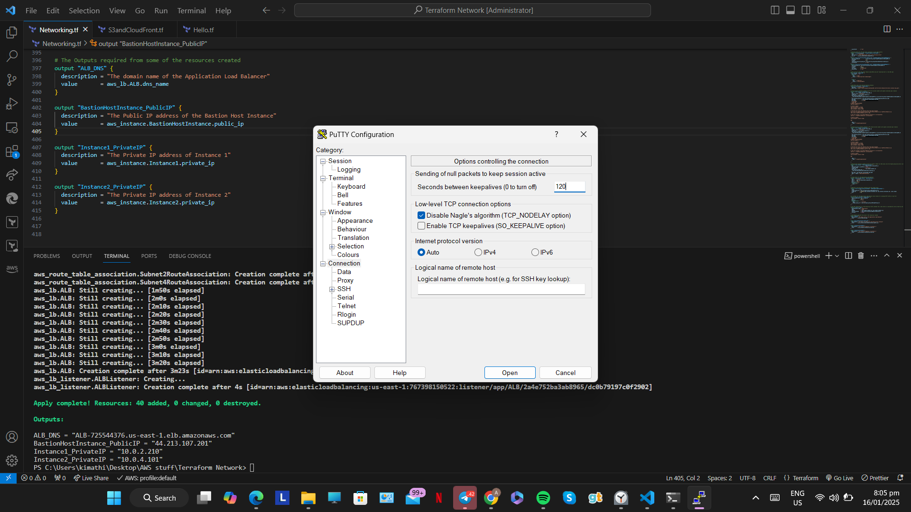

- Next we allow agent forwarding since the Bastion host needs to reach the private web server

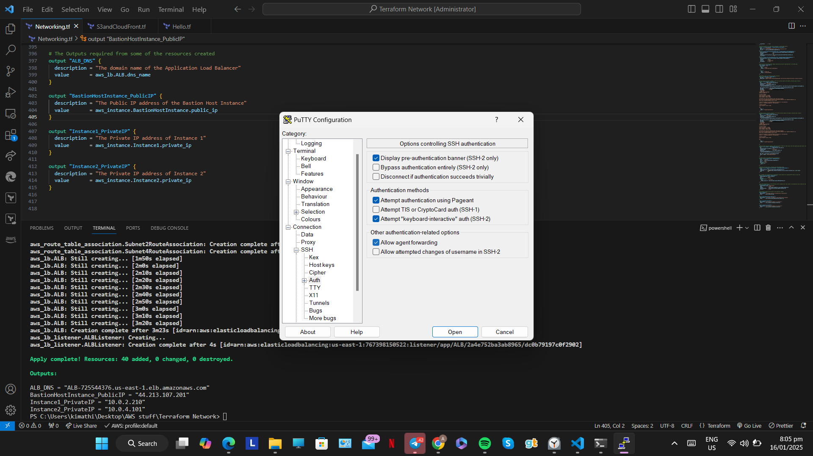

- Under credentials, select the private key for the Bastion Host(the same key for the web servers) and click on open to start the connection.

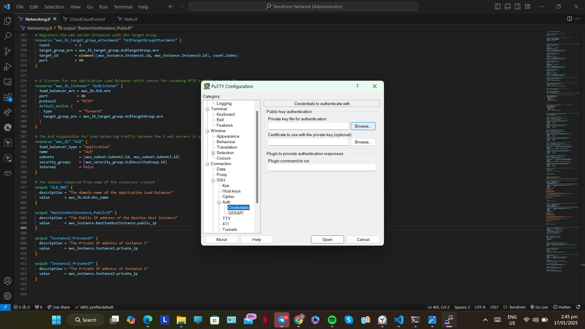   
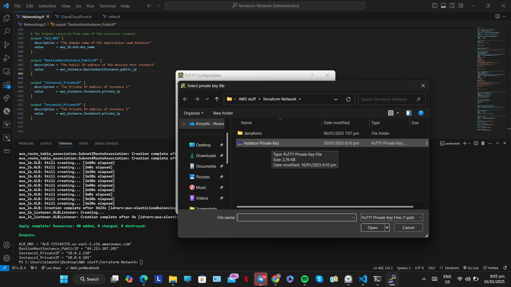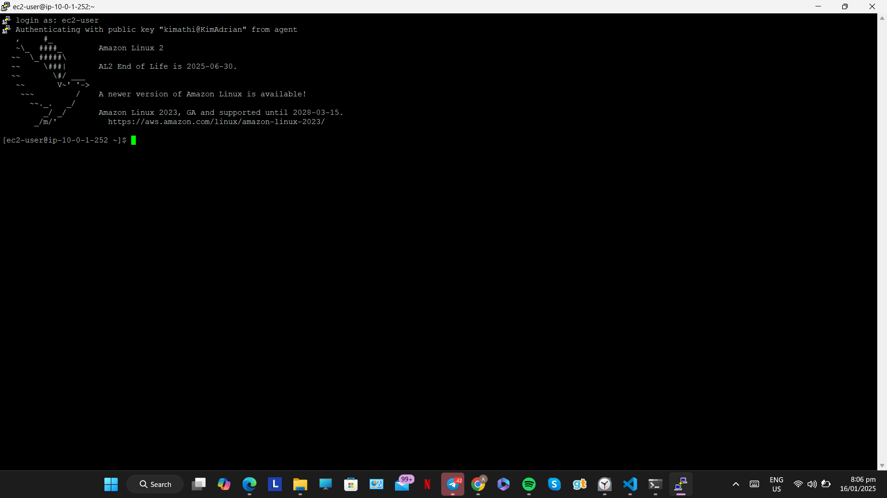

- You can now connect to the private web servers using the command: ssh ec2-user@”Private-instance-Private-IP”  
- Install the stress test using: sudo yum install \-y epel-release  
- sudo yum install \-y stress  
- Then stress all cores of the CPU using: stress \--cpu $(nproc)

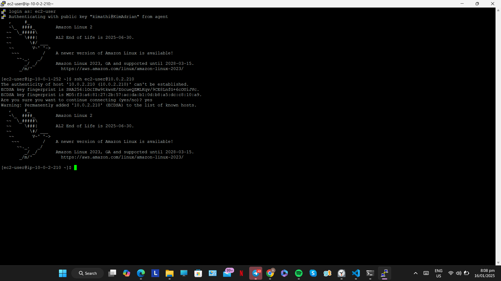

- After about 5-6 minutes, the CPU utilization of the web server instance is at 100%. The load balancer now forwards any incoming traffic to the other web server.

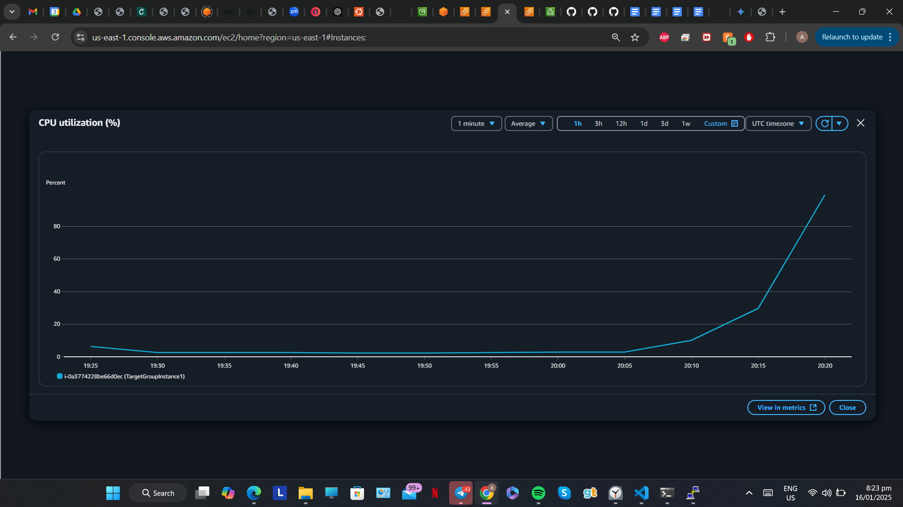

- The web site is still up even when the web server is under significant load.

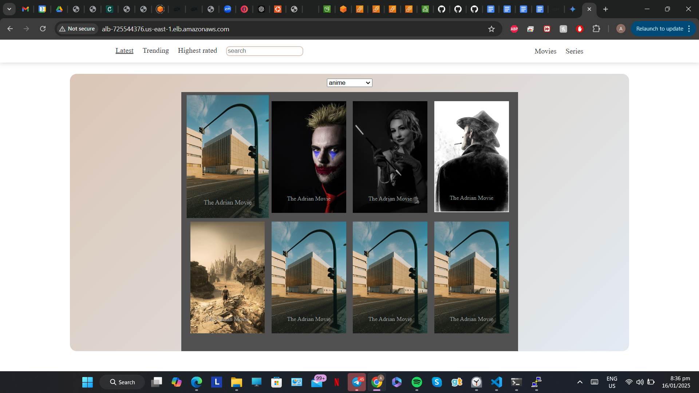

- Remember to run: “terraform destroy” to delete all resources in the AWS account created by Terraform.

**Challenges encountered and lessons learned**

1. Apache kept failing to install originally when I ran my terraform file so my web servers kept being labeled as unhealthy in the target group. Upon investigation in the instance logs, I discovered that the apache installation kept failing because the instance did not yet have internet access at the time the user data script was being run. Linux tried to run that part of the script six more times before skipping over it. This was because when the instance was being launched, the other network resources like the NAT gateway, internet gateway and elastic IP had not been created yet. In order to solve this, I gave the script a sleep time of 180 seconds: “sleep 180”. This means that Linux would only attempt to run the user script 3 minutes after the instance had been created. This was enough time for all other network resources to have been created.  
   

**Future plans**  
In one of my upcoming projects, this Networks environment will be reused to host an actual functioning dynamic movie website with Dynamo db, S3 and Lambda as the database layer of the website.
